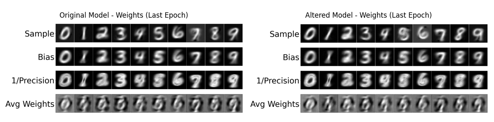

# Deep Generative Models - Final course project

Based on the paper: 
"Neural Boltzmann Machines" – Alex H. Lang, Anton D. Loukianov, Charles K. Fisher, 2023.
https://doi.org/10.48550/arXiv.2305.08337

GitHub link: https://github.com/unlearnai/neural-boltzmann-machines.git

--------------------------------------------------------------------------------------------------------------------------------------------------------

The altered code is located in the python files: NBM_altered.py and train_altered.py.
My code is using the original util.py and datasets.py files.  
The comparison code is in comparison_final.py

The figures from the comparison results are located in the comparison_results folder.   
The figure and other file (like csv) from the original model and from the altered model are located in the folder Original and altered results.

--------------------------------------------------------------------------------------------------------------------------------------------------------

Comparison output (prints):

Final Metrics Comparison:
| Version  | Final CD Loss | Final Bias MSE | Final Var MSE |
|----------|----------------|----------------|----------------|
| Original | -99.8137       | 0.2363         | 0.6091         |
| Altered  | -194.7226      | 0.2066         | 0.5755         |

Average Metrics Comparison:
| Version  | Avg CD Loss   | Avg Bias MSE   | Avg Var MSE   |
|----------|----------------|----------------|----------------|
| Original | -153.7486      | 0.2224         | 0.5955         |
| Altered  | -147.3095      | 0.2271         | 0.5913         |

Training Time Summary:
| Version  | Total Time (sec) | Avg Time/Epoch (sec) | Epochs |
|----------|------------------|-----------------------|--------|
| Original | 9104.35          | 182.09                | 50     |
| Altered  | 6979.34          | 139.59                | 50     |

Speed-Up Summary:
Total training time reduced by: 23.34%
Saved: weights_comparison_epoch_49.png

Statistical Significance Tests (Paired t-test):
| Metric           | p-value        | Result      |
|------------------|----------------|-------------|
| CD_Loss          | 1.5316e-16     | Significant |
| MSE_Bias_Loss    | 1.5309e-109    | Significant |
| MSE_Var_Loss     | 4.5404e-72     | Significant |

Comparison complete. Results saved to comparison_results/ folder.
